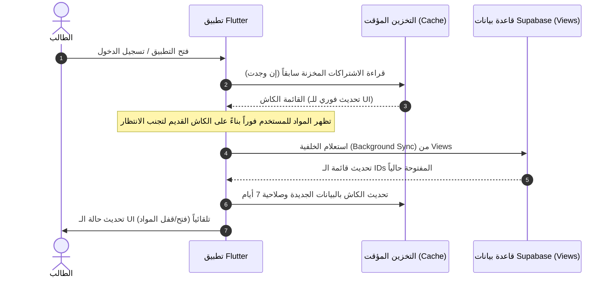

# مخططات عمل نظام الاشتراكات والتحقق (Workflows & Scenarios)

يوضح هذا المستند الحالات المختلفة للوصول إلى المواد وكيفية تفاعل قاعدة البيانات والتطبيق وإدارة التخزين المؤقت (Cache) لتقديم تجربة مستخدم سريعة وآمنة.

---

## 1. سيناريوهات منح صلاحية الوصول (Access Scenarios)

هناك **ثلاثة سيناريوهات رئيسية** لتحديد ما إذا كانت المادة (علمية أو عملية) مفتوحة للطالب:

### السيناريو أ: اشتراك خاص بالطالب (Individual Subscription)
* **الوصف**: يقوم المسؤول (Admin) بتفعيل مادة معينة لطالب محدد بالبحث عنه في لوحة التحكم وتفعيل الاشتراك له.
* **الآلية في قاعدة البيانات**:
  * يتم إدراج سجل في جدول `user_subscriptions`:
    * `user_id`: معرف الطالب (UUID).
    * `subject_id` (للمادة العلمية) أو `clinical_subject_id` (للمادة العملية).
    * `status`: `'active'`.
    * `expires_at`: تاريخ الانتهاء (أو تركها فارغة لصلاحية دائمة).

### السيناريو ب: إتاحة المادة لجامعة بأكملها (University-Wide Access)
* **الوصف**: تفعيل مادة أو جميع المواد لكل طلاب جامعة معينة (مثل "جامعة الموصل").
* **الآلية في قاعدة البيانات**:
  * يتم إدراج سجل في جدول `university_access` يربط اسم الجامعة بالمادة:
    * `university`: اسم الجامعة المطابق تماماً لبيانات الطلاب (مثال: `"كلية طب نينوى"`).
    * خيارات الإتاحة:
      1. إتاحة مادة علمية معينة (`subject_id`).
      2. إتاحة مادة عملية معينة (`clinical_subject_id`).
      3. إتاحة جميع المواد العلمية دفعة واحدة بوضع `all_scientific = true`.
      4. إتاحة جميع المواد العملية دفعة واحدة بوضع `all_practical = true`.

### السيناريو ج: صلاحية المسؤولين (Admin/Owner/Manager)
* **الوصف**: يمتلك مديرو النظام وصولاً شاملاً وتلقائياً لجميع المواد العلمية والعملية دون الحاجة لاشتراكات.
* **الآلية**: يتم التعرف عليهم مباشرة من حقل `role` في جدول `users` إذا كان قيمته `'admin'` أو `'owner'` أو `'manager'`.

---

## 2. مخطط تدفق عمليات الدخول والتحقق (Entry Workflow)

يوضح المخطط التالي ما يحدث خطوة بخطوة عند تشغيل التطبيق ودخول شاشة المواد:

---

## 3. التعامل مع الكاش والتحديث (Caching & Syncing)

### كيف يتعامل الكاش مع تحديثات الإدارة؟
1. **عند فتح التطبيق**: يتم قراءة الكاش فوراً وعرض الواجهة، ثم يجري التطبيق استعلاماً سريعاً في الخلفية مع قاعدة البيانات لتحديث الصلاحيات. إذا قامت الإدارة بتفعيل مادة جديدة، ستظهر للطالب فور انتهاء الاستعلام القصير دون الحاجة لإعادة تشغيل التطبيق.
2. **عند تسجيل الخروج**: يتم مسح كاش الاشتراكات بالكامل لضمان عدم بقاء الصلاحيات لحساب آخر.
3. **العمل بدون إنترنت (Offline Mode)**: إذا انقطع الاتصال بالإنترنت، يعتمد التطبيق تماماً على آخر كاش تم حفظه (يستمر حتى 7 أيام)، مما يسمح للطالب بتصفح مواده المفعلة مسبقاً دون انقطاع.

---

## 4. سيناريوهات واجهة المستخدم (UI Scenarios)

### الحالة 1: المادة مفتوحة (Unlocked Subject)
* **المظهر**: تظهر بطاقة المادة شفافة بنسبة 100% مع كامل تفاصيل تقدم الطالب.
* **عند الضغط**: يتم فتح صفحة المواضيع/المحطات التفصيلية مباشرة.

### الحالة 2: المادة مغلقة (Locked Subject)
* **المظهر**: 
  1. تظهر بطاقة المادة باهتة (Opacity 60%).
  2. يظهر رمز قفل صغير (Lock icon) في الزاوية العلوية للبطاقة.
* **عند الضغط**: 
  1. يتم حجب الانتقال.
  2. يظهر مربع حوار (AlertDialog) باللغة العربية يبلغ الطالب بأن المادة مغلقة وتتطلب اشتراكاً نشطاً.

### الحالة 3: محاولة الالتفاف والدخول المباشر (Bypass Guard)
* **السيناريو**: إذا حاول مستخدم متقدم استخدام رابط عميق (Deep Link) أو تعديل برمجي للوصول لصفحة المواضيع لمادة مغلقة:
  1. بمجرد تحميل الصفحة، يتم تفعيل **الحارس الخلفي** (Navigation Guard).
  2. يقارن الحارس اسم المادة بقائمة الـ IDs المفتوحة في `AppProvider`.
  3. يتم إغلاق الصفحة فوراً وإرجاع المستخدم للخلف (`Navigator.pop`).
  4. تظهر رسالة تنبيه أسفل الشاشة (SnackBar): *"عذراً، هذه المادة تتطلب اشتراكاً نشطاً."*
