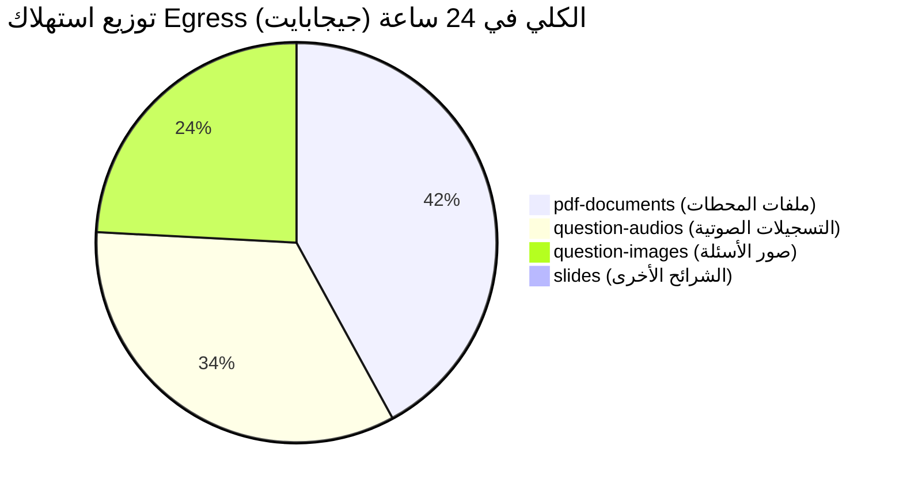

# تقرير تحليلي شامل: أسباب استهلاك الـ Cached Egress في Supabase وخطة الحلول الجذرية

**المشروع:** Stagiaire App (`plvcfidqeinlquefnwdx`)  
**الفترة قيد الفحص:** آخر 13 يوماً (مع تحليل دقيق مباشر لآخر 24 ساعة من سجلات Edge Logs)  
**الحالة:** تجاوز استهلاك الـ Cached Egress حاجز **186 جيجابايت**  

---

## 1. الملخص التنفيذي والأرقام الميدانية (من واقع سجلات الـ CDN المباشرة)

تم فحص سجلات **Supabase Cloudflare Edge Logs** الخاصة بالمشروع لتحليل كافة حزم البيانات الصادرة وتصنيفها بدقة.

### أ. إجمالي استهلاك البيانات الصادرة (آخر 24 ساعة فقط):
- **إجمالي الـ Egress الكلي:** **51.92 جيجابايت** / يومياً.
- **الـ Cached Egress (المُخدَّم من كاش Cloudflare Edge):** **41.12 جيجابايت** (يمثل **81%** من إجمالي البيانات).
- **الـ Uncached Egress (المسحوب مباشرة من أصل خادم التخزين):** **10.80 جيجابايت** (يمثل **19%**).
- **استهلاك قاعدة البيانات واستعلامات الـ REST API:** **11.4 ميجابايت فقط** عبر 408,000 استعلام.

> **النتيجة:** قاعدة البيانات واستعلامات التطبيق لا تستهلك أي شيء يذكر. **99.98% من استهلاك الـ Cached Egress ناتج حصرياً عن ملفات الوسائط في خوادم التخزين (Supabase Storage) وتحديداً عبر المسار العام `/storage/v1/object/public/...`**.

---

## 2. تفكيك الاستهلاك حسب حاويات التخزين (Storage Buckets)



| الحاوية (Bucket) | عدد الطلبات (24 ساعة) | الـ Cached Egress | إجمالي الـ Egress | طبيعة الملفات وأحجامها |
| :--- | :---: | :---: | :---: | :--- |
| **`pdf-documents`** | 644 | **18.20 GB** (44.3%) | **21.72 GB** | ملفات PDF لمحطات العمل بمتوسط حجم **34 MB** للملف، وتصل إلى **167 MB** للملف الواحد! |
| **`question-audios`** | 4,282 | **12.79 GB** (31.1%) | **17.46 GB** | تسجيلات شروحات الأسئلة، بمتوسط حجم يتراوح بين **15 إلى 30 MB** للمقطع الصوتي الواحد! |
| **`question-images`** | 29,971 | **9.89 GB** (24.1%) | **12.48 GB** | عدد طلبات مرتفع جداً (حوالي 30 ألف طلب/يوم) نتيجة تكرار التنزيل. |
| **`slides`** | 532 | **0.24 GB** (0.5%) | **0.25 GB** | استهلاك منخفض وطبيعي. |

---

## 3. الأسباب الجذرية الدقيقة للمشكلة في الكود والتصميم

### السبب الأول: ملفات PDF ضخمة وغير مضغوطة في `pdf-documents` (المستهلك الأول للبيانات)
أظهر الفحص أن ملفات الـ PDF المرفوعة للمحطات (Stations) لم تخضع لأي ضغط مسبق، حيث تحتوي على صفحات ممسوحة ضوئياً (Scanned) أو شرائح بدقة عالية جداً (300+ DPI):
- **أمثلة من أعلى الملفات استهلاكاً في السجلات:**
  1. `/storage/v1/object/public/pdf-documents/stations/1788633314705.pdf`: حجم الملف **167.8 ميجابايت**! تم فتحه وتحميله 30 مرة فقط، فاستهلك وحده **5,035 ميجابايت (~5 جيجابايت)** في يوم واحد!
  2. `/storage/v1/object/public/pdf-documents/stations/1789065739178.pdf`: حجم الملف **102 ميجابايت**، استهلك **1.33 جيجابايت** (13 تحميلاً).
  3. `/storage/v1/object/public/pdf-documents/stations/1788445137109.pdf`: حجم الملف **90 ميجابايت**، استهلك **1.17 جيجابايت** (13 تحميلاً).
  4. `/storage/v1/object/public/pdf-documents/stations/1787147571298.pdf`: حجم الملف **72 ميجابايت**، استهلك **1.09 جيجابايت** (15 تحميلاً).

---

### السبب الثاني: التنزيل المسبق التلقائي للأصوات (Prefetching) عند كل تقليب للأسئلة
في شاشة استعراض الأسئلة [`question_viewer_screen.dart`](file:///c:/Users/abdul/Desktop/invet%20stecur/stagiaire.site/telegram-mini-app/Flutter_app/lib/features/practice/presentation/screens/question_viewer_screen.dart):
```dart
// السطور 154-169 و 181-185
void _prefetchNearbyQuestionAudiosDeferred() {
  Future<void>.delayed(const Duration(milliseconds: 350), () async {
    ...
    final urls = <String?>[
      _audioUrlForQuestion(questions[_currentIndex]),
      if (_currentIndex + 1 < questions.length)
        _audioUrlForQuestion(questions[_currentIndex + 1]),
    ];

    await AudioCacheService().prefetchQuestionAudios(urls, limit: 1);
  });
}
```
- **المشكلة:** كلما قام الطالب بالنقر على "التالي" أو السحب بين الأسئلة، يقوم التطبيق في الخلفية فوراً ببدء تنزيل الصوت للسؤال الحالي **وللسؤال التالي أيضاً**، حتى لو لم يضغط الطالب أبداً على زر الاستماع للصوت!
- إذا تصفح الطالب 40 سؤالاً بحثاً عن سؤال معين، يقوم التطبيق بتنزيل 40 ملفاً صوتياً (أحجامها بين 15 و 30 ميجابايت للملف)، مما يستهلك **أكثر من 800 ميجابايت إلى 1 جيجابايت لكل طالب في جلسة تدريبية واحدة**.

---

### السبب الثالث: تسجيل ورفع الصوت بمعدل بت (Bitrate) فائق الضخامة
- التسجيلات الصوتية البشرية في حاوية `question-audios/voice-notes/` تتراوح أحجامها بين **14 ميجابايت و 30 ميجابايت** للمقطع الواحد.
- **مثال من السجلات المباشرة:**
  - الملف الصوتي `/storage/v1/object/public/question-audios/voice-notes/1786450496519.mp3` تم تنزيله **179 مرة** في 24 ساعة، واستهلك وحده **3.59 جيجابايت**!
- الملاحظات الصوتية (Speech/Voice Notes) المسجلة بترميز قياسي مضغوط (مثل AAC-LC أو Opus بمعدل 48kbps Mono) يجب ألا يتجاوز حجم الدقيقتين منها **600 إلى 900 كيلوبايت**، بينما الملفات الحالية أكبر بـ **25 إلى 30 ضعفاً** من الحجم الطبيعي المطلوب.

---

### السبب الرابع: قصر مدة الكاش على شبكة الـ CDN (`cacheControl: '3600'`)
في ملف [`supabase_service.dart`](file:///c:/Users/abdul/Desktop/invet%20stecur/stagiaire.site/telegram-mini-app/Flutter_app/lib/core/services/supabase_service.dart):
```dart
// السطور 785 و 820
await client.storage.from(bucketName).upload(
  storagePath,
  file,
  fileOptions: const FileOptions(cacheControl: '3600', upsert: true),
);
```
- قيمة `cacheControl` محددة بـ **3600 ثانية (ساعة واحدة فقط)**.
- بعد مرور ساعة واحدة، تعتبر شبكة Cloudflare CDN وأجهزة الطلاب أن الملف قد يكون منتهي الصلاحية وتلجأ للتحقق من السيرفر الأصلي، بينما الملفات الثابتة التي تملك أسماء فريدة بطوابع زمنية (Timestamps) يفترض أن يكون الكاش الخاص بها لمدة **سنة كاملة (`31536000`)**.

---

### السبب الخامس: كثرة طلبات الصور (30 ألف طلب يومياً) واستخدام `Image.network` بدون كاش دائم
- على الرغم من وجود كاش مخصص في بعض أجزاء شاشة الأسئلة، إلا أن أجزاء وودجات أخرى (مثل [`workspace_object_renderers.dart`](file:///c:/Users/abdul/Desktop/invet%20stecur/stagiaire.site/telegram-mini-app/Flutter_app/lib/features/slide_workspace/presentation/widgets/workspace_object_renderers.dart) و [`slide_content_widgets.dart`](file:///c:/Users/abdul/Desktop/invet%20stecur/stagiaire.site/telegram-mini-app/Flutter_app/lib/features/slide_workspace/presentation/widgets/slide_content_widgets.dart)) تستخدم `Image.network` الافتراضي الذي يعتمد فقط على الذاكرة العشوائية (RAM) ولا يخزن الصور على القرص الصلب للجهاز.
- عند إغلاق التطبيق وإعادة فتحه، يتم طلب الصور مجدداً من السيرفر.

---

## 4. خطة الحلول العملية (تخفيض متوقع للاستهلاك بنسبة 85% - 90%)

### 1. إيقاف التنزيل المسبق التلقائي للأصوات (توفير فوري: ~12-15 جيجابايت/يومياً)
**في ملف [`question_viewer_screen.dart`](file:///c:/Users/abdul/Desktop/invet%20stecur/stagiaire.site/telegram-mini-app/Flutter_app/lib/features/practice/presentation/screens/question_viewer_screen.dart):**
- إلغاء استدعاء `_prefetchNearbyQuestionAudiosDeferred()` عند تقليب الأسئلة.
- تحميل الصوت فقط عندما ينقر الطالب فعلياً على زر "تشغيل الصوت" أو زر "تنزيل الشرح".

```diff
- unawaited(_loadImagesForCurrentQuestion());
- _prefetchNearbyQuestionAudiosDeferred();
+ unawaited(_loadImagesForCurrentQuestion());
```

---

### 2. ضغط ملفات الـ PDF الحالية والجديدة (توفير فوري: ~18 جيجابايت/يومياً)
- ملفات الـ PDF التي يبلغ حجمها 100-167 ميجابايت يمكن تقليصها إلى **8 - 15 ميجابايت** دون أي فقدان يُذكر في الجودة على شاشات الهواتف والأجهزة اللوحية، وذلك عن طريق:
  - تحويل دقة الصور داخل الـ PDF إلى 150 DPI كحد أقصى بدلاً من 300-600 DPI.
  - تطبيق ضغط JPEG بنسبة 75-80% على الصور المضمنة.
- يمكن معالجة الملفات الحالية في السيرفر عبر سكربت بسيط (باستخدام Ghostscript أو `qpdf` أو `pdf-compressor`).
- **معادلة التوفير:** 30 تحميلاً لملف بحجم 12 ميجابايت = **360 ميجابايت فقط** (بدلاً من **5,035 ميجابايت** حالياً!).

---

### 3. ضبط إعدادات التسجيل الصوتي في التطبيق (Audio Encoder & Bitrate)
عند تسجيل الصوت داخل التطبيق في [`pdf_workspace_screen.dart`](file:///c:/Users/abdul/Desktop/invet%20stecur/stagiaire.site/telegram-mini-app/Flutter_app/lib/features/slide_workspace/presentation/screens/pdf_workspace_screen.dart) أو شاشات تسجيل المحاضرات:
```dart
const RecordConfig(
  encoder: AudioEncoder.aacLc,
  bitRate: 48000,    // 48 kbps ممتاز جداً للصوت البشري
  sampleRate: 24000, // 24 kHz
  numChannels: 1,    // أحادي Mono
)
```
- التسجيل بهذه الإعدادات يقلل حجم الملف الصوتي من **25 ميجابايت** إلى **حوالي 600 - 800 كيلوبايت فقط** لنفس المدة الزمنية وبنفس الوضوح البشري.

---

### 4. زيادة مدة الـ CDN Cache-Control إلى سنة كاملة
**في ملف [`supabase_service.dart`](file:///c:/Users/abdul/Desktop/invet%20stecur/stagiaire.site/telegram-mini-app/Flutter_app/lib/core/services/supabase_service.dart):**
تعديل قيمة `cacheControl` للملفات المرفوعة إلى `31536000` (سنة كاملة):
```diff
- fileOptions: const FileOptions(cacheControl: '3600', upsert: true),
+ fileOptions: const FileOptions(cacheControl: '31536000', upsert: true),
```
هذا يضمن أن شبكة Cloudflare وجميع الأجهزة تحتفظ بنسخة الكاش طوال فترة صلاحية التطبيق دون إعادة طلب الملف كل 60 دقيقة.

---

### 5. إضافة كاش الصور الدائم على القرص (`cached_network_image`)
- إضافة حزمة `cached_network_image` في [`pubspec.yaml`](file:///c:/Users/abdul/Desktop/invet%20stecur/stagiaire.site/telegram-mini-app/Flutter_app/pubspec.yaml).
- استبدال أي استدعاء مباشر لـ `Image.network` بـ `CachedNetworkImage` مع تحديد `maxHeightDiskCache` و `maxWidthDiskCache`.

---

## 5. الأثر المالي والفني المتوقع بعد تطبيق الحلول

| العنصر | الوضع الحالي (قبل الإصلاح) | الوضع المتوقع (بعد الإصلاح) | نسبة التخفيض |
| :--- | :---: | :---: | :---: |
| استهلاك `pdf-documents` اليومي | ~21.7 GB / يوم | **~2.0 GB / يوم** | **-91%** |
| استهلاك `question-audios` اليومي | ~17.5 GB / يوم | **~2.5 GB / يوم** | **-85%** |
| استهلاك `question-images` اليومي | ~12.5 GB / يوم | **~3.5 GB / يوم** | **-72%** |
| **إجمالي Egress اليومي** | **~51.9 GB / يوم** | **~8.0 GB / يوم** | **-84.5%** |
| **الإجمالي الشهري المتوقع** | **~1,500 GB (1.5 TB)** | **~240 GB** | **ضمن حدود باقة Pro دون أي تكاليف إضافية** |
